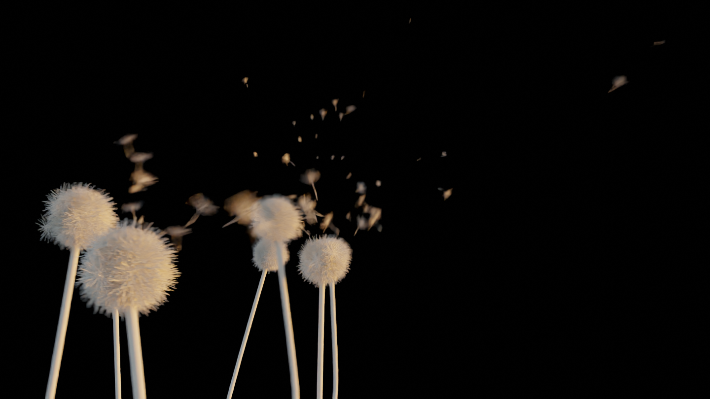

## Dandelion Procedural Animation

Blender Python API for procedural animation of Dandelion.

Phenomenological model aimed for appearance.

## Artistic results:

## Videos:

https://vimeo.com/737261767

https://vimeo.com/737268791

## Tutorial

Current script is not optimized for usage by others (yet).

General idea:

1. Generate positions of Dandelion heads:

2. Generate Dandelion head, stem and fliers:

3. Animate using noise:

